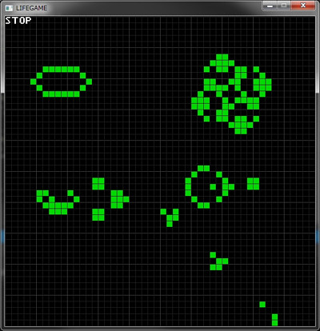

# LIFEGAME
DXLib + C++で制作したライフゲーム  
ビルドしたものはこちら  
https://www.dropbox.com/s/btqodigzhqeq8y7/LIFEGAME.zip  

## 操作方法
* Space
    * ポーズ
* rキー
    * リセット

### ポーズ中に可能
* nキー
    * 1世代進める
* 左クリック
    * 生存セルを作る
* 右クリック
    * セルを殺す

